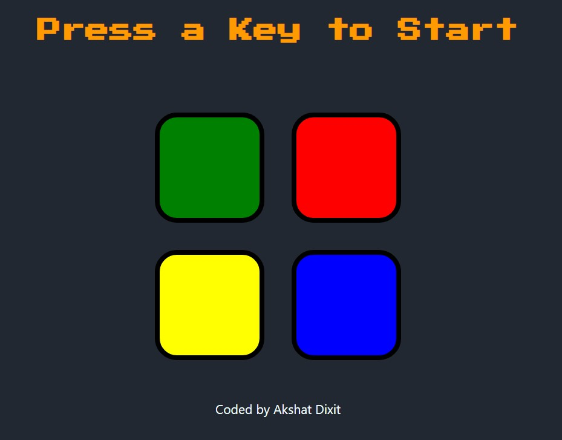

# Interactive Simon Memory Game

Test your memory and pattern recognition skills with this nostalgic and interactive Simon Memory Game. Recreate the classic gameplay experience through a modern web-based implementation using HTML, CSS, and JavaScript.

## Table of Contents

- [Demo](#demo)
- [Features](#features)
- [Installation](#installation)
- [How to Play](#how-to-play)
- [Contributing](#contributing)
- [License](#license)

## Demo

## Features

- **Classic Gameplay:** Relive the timeless Simon game, where you must repeat a sequence of colored lights and sounds.
- **User-Friendly Interface:** Colorful buttons provide a visually appealing and intuitive user interface.
- **Interactive Experience:** Click on buttons to mimic the sequence and progress through increasingly difficult levels.
- **Sound Effects:** Immerse yourself with auditory feedback for each button press.
- **Progressive Challenge:** Face escalating challenges as the sequences become more complex.

## Installation

1. Clone the repository: `git clone https://github.com/yourusername/simon-memory-game.git`
2. Navigate to the project directory: `cd simon-memory-game`

## How to Play

1. Open `index.html` in your preferred web browser.
2. Watch and listen to the sequence of colors played by the game.
3. Click the buttons in the same order to mimic the sequence.
4. As you progress, the sequences will get longer and more challenging.
5. Aim for a high score by accurately repeating the patterns!
